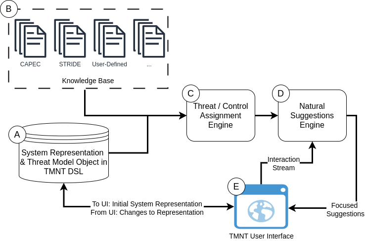

# TMNT

Welcome to the Tufts Security & Privacy Lab's (TSP) Threat Modeling Naturally Tool! This tool is part of ongoing work by TSP into threat modeling and leverages findings from our work.

You can use TMNT in one of two ways: via a Python package (see [Python Package README](tmnt/README.md)) or via our UI (see [UI README](ui/README.md)).

The TMNT Python package consists of the code for the DSL (`tmnt.dsl`), the various engines (`tmnt.engines`), and the knowledge base of threats and controls (`tmnt.kb`). The UI can be self-hosted (see [UI README](ui/README.md) for details) or can be accessed at `tsp.eecs.tufts.edu/tmnt`, where you can test out the tool and create a user profile and save your threat models.

The rough system design looks like this:



## Wall of Contributors

- Ron Thompson (2023 - pres.)
- Christopher Pellegrini, now at Northeastern (2023 - 2024)
- Madison Red (2023 - 2024)
- Richard Zhang (2023 - 2024)
- Mira Jain (2023 - 2024)
- Caroline Chin (2023 - 2024)

## Related Research from TSP

```
Ronald Thompson, Madeline McLaughlin, Carson Pow-
ers, and Daniel Votipka. There are rabbit holes i want
to go down that i’m not allowed to go down: An investi-
gation of security expert threat modeling practices for
medical devices. In 33rd USENIX Security Symposium
(USENIX Security 24), Philadelphia, PA, August 2024.
USENIX Association.
```
[Link](https://www.usenix.org/conference/usenixsecurity24/presentation/thompson)
