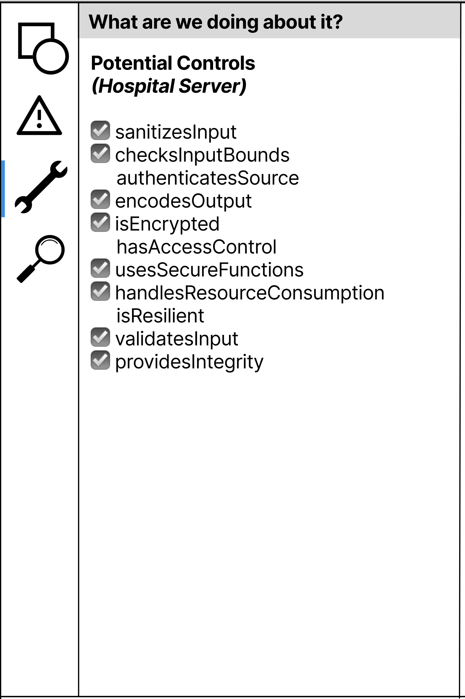
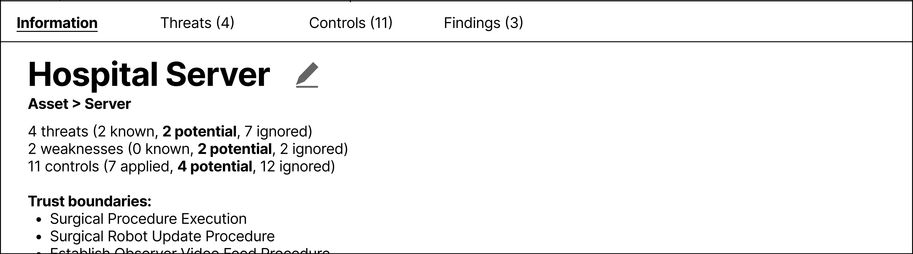

# TMNT Overview
This can also be found in our workshop paper that was presented at WSIW 2024.


## Design Goals for TMNT

### Support varied approaches (D1)
Because architects' navigate the system and consider threats and mitigations in several different ways, TMNT should support all possible approaches. This includes considering threats component-by-component or interaction-by-interaction, as suggested by some threat modeling guides ([CMU - Threat Modeling: 12 Available Methods](https://insights.sei.cmu.edu/blog/threat-modeling-12-available-methods/), [Threat Modeling: Designing for Security](https://shostack.org/books/threat-modeling-book), [The STRIDE per Element Chart](https://www.microsoft.com/en-us/security/blog/2007/10/29/the-stride-per-element-chart)); focusing on specific system use cases ([Thompson et al.](https://www.usenix.org/conference/usenixsecurity24/presentation/thompson)); or considering centers of gravity ([Stevens et al.](https://www.usenix.org/conference/usenixsecurity18/presentation/stevens)). The user should also be able to switch between these approaches freely. Naturally, the UI should be designed to allow users to focus on relevant elements of the described system. Additionally, TMNT should be able to identify potential threats and mitigations through the lens of different system views.

### Uninterrupted brainstorming (D2)
While TMNT should be able to provide threat and mitigation suggestions to support a wide variety of threat modeling approaches, it must be strategic in how these threats are presented. Many current tools present the full list of suggested threats and mitigations to users. This produces overwhelmingly long lists that are hard for users to parse. Instead, we propose filtering suggestions to the users' current focus, engaging their natural tendencies and avoiding breaking their focus, which is common practice in supporting brainstorming ([Toward More Creative and Innovative Group Idea Generation](https://compass.onlinelibrary.wiley.com/doi/abs/10.1111/j.1751-9004.2007.00006.x), [Nijstad & Stroebe](https://doi.org/10.1207/s15327957pspr1003_1)).

### Incomplete information and alternative configurations (D3)
TMNT must allow the system model to have flexible representations. The architect might know there are many ways the system could be deployed or not know the exact nature of its deployment ([Faily & Iacob](https://ieeexplore-ieee-org.ezproxy.library.tufts.edu/document/8054833), [Thompson et al.](https://www.usenix.org/conference/usenixsecurity24/presentation/thompson)). When analyzing the system model for potential threats and mitigations, TMNT should consider these different possible system representations. This also has the added benefit of allowing architects to produce threat models as the system is being designed, supporting secure-by-design from system inception ([Shifting the Balance of Cybersecurity Risk](https://media.defense.gov/2023/Apr/13/2003198917/-1/-1/0/CSI_Secure_by_Design_Default.PDF).

### Evolving Interface (D4)
Given that there is a learning curve to threat modeling and that users may have different levels of expertise, the interface should allow for *graceful evolution* ([Ben Shneiderman's Designing the User Interface](http://seu1.org/files/level5/IT201/Book%20-%20Ben%20Shneiderman-Designing%20the%20User%20Interface-4th%20Edition.pdf)). Features like drag-and-drop components and the ability to click and toggle through various system views help build an *intuitive* design that architects can learn as they use ([Ben Shneiderman's Designing the User Interface](http://seu1.org/files/level5/IT201/Book%20-%20Ben%20Shneiderman-Designing%20the%20User%20Interface-4th%20Edition.pdf)). Novice users will be presented with more specific instructions that will evolve to become interpretative with their experience ([Lim, Benbasat, & Todd](https://doi.org/10.1145/226159.226160)). As architects become more familiar with TMNT and threat modeling, they should also be able to switch to a view with more fine-grained control over the system representation.

### Component Modularity (D5)
To allow practitioners in different domains to tailor the system to their particular context, components should be developed modularly to allow users to swap in alternative versions ([Parnas](https://doi.org/10.1145/361598.361623). For example, medical device architects might prioritize different types of threats than power suppliers, necessitating different threat suggestion engines. An architect can also be given the option to use modules for formal threat modeling processes like STRIDE and LINDDUN. Additionally, as more advanced AI methods become available, it may become useful to incorporate these techniques to identify novel suggested threats and mitigations. Finally, the knowledge base of threats and mitigations should be easy to update and extend to give architects access to the quickly growing security knowledge base as they threat model.


## Modules

### DSL (tmnt.dsl)

As part of building TMNT, we needed a robust, flexible DSL to allow a complete representation of all objects in the threat model. This DSL should support the ability to analyze and verify a threat model and allow threat modeling components to be reused in later models ([Mernik, Heering, & Sloane](https://doi.org/10.1145/1118890.1118892)). While there has been prior work establishing DSLs for threat modeling ([Threat Modeling DSLs](ThreatModelingTools.md), none fully met our design requirements. Many of these DSLs only support a specific set of rules to apply threats and controls, violating D1. Others only support a limited set of threat annotations, which does not lend itself to modularity (**D5**). Some require significant additional software development before they can be used, making it difficult for novices (**D4**). Rather than trying to modify one of these tools to fit our needs, we created our own DSL guided by our design goals and inspired by ideas from these existing DSLs.

In our DSL, a threat modeling object consists of a set of **Components** representing the system. These components can be **Elements**, which are objects in the system representation, **Threats**, or **Controls**. To allow for varied approaches (**D1**) and alternative configurations (**D3**), we included more specific types of **Elements** that help more readily differentiate between them, using the components of Data Flow Diagrams as a starting point, i.e., datastore, process, data flow, external entity, and trust boundary. We then added more levels of specificity that are associated with more complex system representations that DFDs cannot necessarily capture ([Sion, Yskout, Van Landuyt, van den Berghe, & Joosen](https://doi.org/10.1145/3387940.3392221), [Faily, Scandariato, Shostack, Sion, & Ki-Aries](https://arxiv.org/abs/2006.04098)) and are found in other threat modeling DSLs. One of these was to create a **Flow** abstraction that is not necessarily a data flow, allowing users to capture more complex workflows that are relevant to the system. Additionally, we allow the user to specify parent-child relationships between the elements, allowing them to *zoom* in and out depending on their needs. Expert users can directly manipulate the DSL representation of their system to allow fine-grained edits (**D4**), and objects in the language can be sub-typed, or other classes can be added, supporting modularity (**D5**)

The TMNT DSL provides an overarching framework to describe a system on a macro level while having the ability to focus on specific aspects of the system in question and how they relate to one another. Establishing these relationships allows users to highlight important system workflows and see how threats might be connected. As the user creates the various assets and information flows, they can specify the security properties (e.g., confidentiality, integrity, availability, non-repudiation, authorization, and authenticity) relevant to that specific component and the associations it has with other parts of the system.

An example of YAML cofiguration:
```yaml
name: Surgical Robot
    type   : Asset
    trust_boundaries : OR
    security_properties :
        confidentiality  : LOW
        integrity : HIGH
        availability : HIGH

    name: Surgical Procedure Execution Flow
    type   : Workflow
    src :
        name : Surgeon Workstation
    dst :
        name : Surgical Robot
    path :
        name : Hospital Infrastructure
    controls :
        authentication : Certificated-based
        multifactor : true
```

### Knowledge Base (tmnt.kb)

This is where all of the threats, controls, etc. are found. You can load specific data sources with a simple call, ex. `tmnt.kb.load_capec()`. This will allow you to inspect and use various threats and controls as TMNT DSL objects. These are called upon and assigned in the various Engines that are available.

Many other tools hard-code the threats and controls into the application itself, relying on the creator's knowledge and potentially leveraging databases such as MITRE's Common Attack Pattern Enumerations and Classifications (CAPEC). In our initial prototype of TMNT, we used CAPEC in addition to custom threats and controls, which we found for our examples. However, users can add their own threats and controls references specifying relationships and requirements based on the DSL.

### Engines (tmnt.engines)

This is where threats and controls are assigned to specific components, set of components, and/or flows based from the KB. Engines can leverage other engines, the KB, or other sources of information (such as logs from the UI in the case of the Natural Suggestion Engine)

#### Threat & Control Assignment Engine
Using the knowledge base(s) selected by the user, TMNT assigns these threats and controls based on the system specified by the user and as the system's representation is updated, keeping with our goal to allow for incomplete information (**D3**). For our prototype, we are using deterministic rules from CAPEC and our own custom threats and controls. Still, TMNT can leverage probabilistic rules based on historical examples of threat models and/or additional rules from alternative sources. Again, this allows TMNT to be customized based on the user's needs (**D4**) and ensures modularity (**D5**).

#### Natural Suggestion Engine
Once a set of threats and controls have been assigned, TMNT must present this information to build on what the user has already done (**D1**) and not interfere with the user's workflow (**D2**). Other tools provide a list of threats based on the system representation once the user indicates they are done, which produces a long list of suggestions that can be hard to navigate. TMNT's goal is to minimize this by instead asking the user what they would like to work on next, whether that is thinking of more threats for the component they are focused on or applying the same control to other parts of the system. This filters the total list of suggestions produced by the Threat/Control Assignment Enginge, showing only the partial list that is relevant to the users' focus. As the user progresses through the threat modeling session, more of the total suggestions list will be presented as their focus changes.

To do this, TMNT uses the list of all the threats and controls that have been identified by the Assignment Engine in conjunction with the user interaction stream that comes from the UI itself. Using various heuristics based on the user's prior interactions, the system's representation, and the potential assignments, TMNT will dynamically recommend potential paths for the user.

### UI (ui)
The final part of TMNT is the UI, which is how users primarily interact with the tool. The UI design requires it to receive suggestions from the Suggestion Engine and present these in a way that does not disrupt the user's workflow (**D2**). Users can use a menu interface and direct manipulation via drag-and-drop, depending on their preferences. The menu provides a more verbose, structured view, which can help guide novice users through the interface ([Lim, Benbasat, & Todd](https://doi.org/10.1145/226159.226160)). Conversely, the drag-and-drop direct manipulation option allows users already familiar with the tool to move quicker through the tool as it reduces the number of clicks necessary for common tasks ([Lim, Benbasat, & Todd](https://doi.org/10.1145/226159.226160)).
The drag-and-drop interface uses icons found in other threat modeling tools to provide a consistent experience. We used the four questions for threat modeling (see [Intro to Threat Modeling](IntroThreatModeling.md)) as a way to group the different menus of activities. Each is described below.

#### What are we building
The user can add elements to the system representation through menu options or direct manipulation. The user can also upload a YAML file specifying the system and any identified threats or controls, as partially shown above. We expect users could develop other parsing tools for direct integration into the architect's workflows.

#### What could go wrong
The user will see a list of potential threats for a selected element; if no element is selected, the user is presented a selection menu for elements they would like to review. The user then selects which threats are relevant. If the user wants to address the threat, they can select a control to apply, and the threat will be marked resolved in the summary bar at the bottom of the UI.


#### What are we going to do about it
The control assignment mirrors threat assignment, whereby the user select the controls they want for a specific element. They then confirm which threat it addresses, which will help draw out implicit assumptions being made, which are common in threat modeling ([Van Landuyt & Joosen](https://doi.org/10.1007/s10270-021-00941-7)). The user can select other elements using the same control, add additional controls to that element, or switch views.



#### Have we done a good enough job
In this last menu option, the user can map controls to threats. The user will evaluate the residual risk for each finding, which maps a threat(s) to a control or a set of controls to a threat. This is done using the questions from [NIST 800-30](https://csrc.nist.gov/pubs/sp/800/30/r1/final), but it could also be updated based on the user's risk assessment framework.



As the user makes threat model edits, the system representation will be updated, and the user will be able to save and export the threat model as YAML files linking system components to identified threats and controls. Additionally, user interactions are logged by the UI and given to the Natural Suggestion Engine so it can provide recommendations based on user focus, as well as what they historically have focused on (and not focused on) to provide suggestions that allow the user to create a robust threat model.


#### Notes from End of Spring 2024

other

- type annotation for different python versions (generic list type works currently with python 3.11, but would be better to have lists of specific types)
- property getters/setters missing in various places
- enforce unique controls, implement control catalog
- remove_introduction, remove_detection_method in Weakness

update yaml/documentation

- required_skills, required_resources in Threat should be lists of dicts, not strings
- conditions in Weakness should be something else
- mitigations is list of dict for weakness and list of str for threat
- change description to desc
- add_elem/remove_elem removed in component
- required attributes for Control
- added related attr for Control
